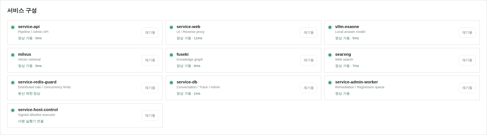

# Reliable Domain Agent Harness & Verification

### Bounded Execution · Evidence Verification · Recovery · Provenance · Replay

[](https://github.com/YeongjoonKim/reliable-domain-agent-harness/actions/workflows/ci.yml)

명시적 계획에 따른 도구 실행, 정형 근거·주장 검증, 제한된 복구와 저장된 증거의 재검증을 구현한 **독립 실행형 Agent Harness Reference Implementation**입니다.
검색 결과의 존재와 질문 적합성을 구분하고, claim의 값·범위·정확한 인용 구간을 확인한 뒤 채택하거나 재시도·보류합니다.
공개 합성 Python Core와 운영 상담 시스템·별도 비공개 Scientific Harness의 승인된 개발 증거를 구분해 제공합니다.


## Quick Verification

| 진입점 | 확인할 내용 |
|---|---|
| [Explore Evidence Demo](demo/index.html) | 공개 Python Core가 생성한 5개 시나리오의 실행·거부·복구·Replay 산출물 |
| [Run Locally](#run-locally) | GPU·API Key 없이 실행하는 Python 명령 |
| [Verify Tests & CI](https://github.com/YeongjoonKim/reliable-domain-agent-harness/actions/workflows/ci.yml) | 테스트와 저장소 검사의 commit별 CI 결과 |

GitHub의 위 HTML 링크는 소스 보기입니다. **인터랙티브 화면은 로컬에서** 저장소 루트의
`python3 -m http.server 8000 --bind 127.0.0.1` 실행 후 [localhost:8000/demo/](http://localhost:8000/demo/)에서 엽니다.
저장된 합성 실행 결과를 탐색하며 live LLM·서버·운영 DB를 호출하지 않습니다.
GitHub Pages 사이트의 작동은 아직 확인하지 않았습니다. [정적 사이트 검증 범위](docs/validation.md#static-demo-and-pages).

## Run Locally

Python 3.10+ 표준 라이브러리만 필요합니다. 저장소 루트에서 실행합니다.

```sh
python3 -m src.harness.demo
python3 -m src.harness.evaluation
python3 -m unittest discover -s tests -v
python3 scripts/check_repository.py
```

첫 명령은 부적합 근거 거부 후 대체 도구로 복구한 `COMPLETED` 실행과 Replay의 외부 호출 `0`을 확인합니다.
두 번째는 같은 24개 합성 입력에서 검증·복구 유무를 비교합니다. 일반 실행의 새 산출물은 무시된 `outputs/`에 저장하며,
추적 중인 `examples/`는 명시적 `--update-examples`에서만 갱신합니다. 출력 경로와 데모 생성은 [Public Core](docs/public-core.md#run-and-explore)를 참고하세요.
Docker Sandbox는 기본 실행에 포함되지 않는 [별도 opt-in 검증](docs/public-core.md#sandbox-and-scientific-slice)입니다.

## 대표 검증 증거

| 증거 | 해석 범위 |
|---|---|
| 공개 테스트 79개 통과 | 2026-10-08 로컬 검증: 기존 57개 + 산출물·CLI·HTML 링크 회귀 22개. commit별 결과는 CI와 [검증 기록](docs/validation.md)에서 확인 |
| 24개 synthetic conformance scenarios | 설계된 계약·실패·복구 분기 검사; 독립 도메인 benchmark 아님 |
| Baseline 8/24 · Harness 24/24 | 저장된 [verification/recovery ablation](examples/paired-evaluation.json); 범용 LLM 정확도 수치 아님 |
| 근거 거부·Bounded Retry·Exact Span | 실제 Runtime 실행, typed claim 검증과 정확한 인용·hash 검사 |
| Configuration / Evidence Replay | 저장된 설정·도구 버전·근거로 verifier 재실행; 외부 도구 호출 0 |
| 별도 Docker 실행 기록 | 승인된 로컬 image의 [격리 계산 검증](examples/docker-validation.json); 기본 테스트·웹 데모와 별도 |

[전체 실행 JSON](demo/core-evidence.json) · [Runtime](src/harness/runtime.py) ·
[Verifier](src/harness/verifier.py) · [Replay](src/harness/replay.py) · [평가 범위](docs/evaluation.md).

## Key Engineering Facts

| 항목 | 구현 범위 | 구성 및 구현 |
|---|---|---|
| Runtime | Public Core | 상태 머신, 도구 권한·schema, deadline, 호출·재시도 예산으로 실행 제어 |
| Planning | 운영 / Public Core | 운영 상담의 LLM 질문 이해·coverage plan·검색 라우팅; 공개 코어는 명시적 Plan 실행 |
| Tool Layer | 운영 | 구조화 DB·Vector·KG·웹·Vision을 Capability Catalog로 분류, 구현된 Typed Adapter로 실행 |
| Context / Memory | 운영 | 최근 대화·TurnState·장기 기억을 Context Pack으로 구성 |
| Evidence | 운영 / Public Core | 검색 성공·질문 적합성·근거 충분성을 구분하고 claim별 출처 연결 |
| Verification | 운영 / 별도 Scientific / Public Core | 운영 답변 검증·repair; 별도 Scientific 의미 검토; 공개 코어의 정형 claim·exact span/hash 검증 |
| Evaluation | 운영 / Public Core | 품질 이슈→회귀 케이스→정책 검토; 공개 합성 시나리오의 검증·복구 비교 |
| Observability | 운영 / Public Core | 운영 timing·검색량·검증·LLM usage; 공개 claim provenance·trace |
| Execution Control | 운영 | 관리자 API의 권한·허용 목록, 서명 요청과 호스트 워커, 서비스·배치 상태 관측 |
| Public Harness Core | Public Core | Python 실행·검증 코어, Docker 격리 계산, configuration/evidence replay |
| MCP | Public Core | stdio 기반 initialize / tools/list / tools/call 구현 |
| Current Boundary | 운영 / Public Core | 새 Typed Executor의 상담 통합은 부분 적용; 공개 코어는 정형 근거·합성 도구 범위 |

위 대응표는 서로 다른 구현 영역의 개발 증거입니다. 운영·비공개 Scientific 기능을 공개 코어의 기능으로 합산하지 않습니다.

[운영 구현 대응표](docs/actual-engineering.md) · [Public Core와 소스](docs/public-core.md) ·
[상세 시스템 구성](docs/system-facts.md).

## 대표 사례: 잘못된 검색과 복구

질문이 가상의 작물 재배면적을 요구하는데 같은 작물의 관수 간격 문서가 검색됩니다.
검색은 성공했지만 정보 요구가 달라 거부하고 대체 정형 조회에서 면적 근거를 찾은 후에만
인용 구간과 값을 검증하고 완료합니다. [공개 실행 JSON](examples/recovery.json).

`VERIFYING → REFLECTING → RETRYING → EXECUTING → VERIFYING → COMPLETED`

## 실제 구현 경험

농업 도메인 상담에서 질문·대화 맥락을 검색 계획으로 연결하고,
구조화 DB·Vector·KG·웹·Vision의 근거를 조합해 답변을 생성·검증하는 시스템을 개발했습니다.
관리자는 실행 Trace, 품질 이슈, 회귀 평가, 정책 승인으로 실패 원인과 개선 결과를 확인합니다.

질문·맥락 → 검색 계획 → 도구 실행 → 근거 결합 → 답변·검증 → SSE → Trace·회귀 평가.

별도 **Scientific Harness**에서는 goal·요구별 의미 검토, Evidence Span 선택·검증,
Docker 계산 실행, 저장된 설정·근거의 Replay를 구현했습니다.
서버가 나눈 원문 구간에서 LLM이 ID를 선택하고 서버가 해당 인용을 검증합니다.
기존 상담 전체가 이 새 실행기로 전환된 것은 아니며 [구현별 경계](docs/actual-engineering.md)를 구분합니다.

### 운영 화면

관리자 UI와 읽기 전용 데이터를 기준으로 구현 화면을 구성했습니다.
Architecture Engineering View에서 설계 책임을, 요청 추적과 회귀 평가에서 실행 이력을 확인할 수 있습니다.

### 1. Request Architecture


질문 이해부터 검색·생성·검증·SSE·Trace까지 각 단계의 실행 책임을 살펴보는 Architecture 화면입니다.

### 2. Planning & Tool Integration


Capability Catalog에 등록된 데이터와 실제 Typed Adapter가 연결된 도구를 구분합니다.

### 3. Context & Memory


대화 맥락·장기 기억을 Context Pack으로 구성해 질문 해석에 전달하는 Engineering View입니다.

### 4. Evidence & Verification


요청에 저장된 RAG 지표와 검증 결과입니다. 이 실행은 검증을 통과해 Repair가 필요하지 않았습니다.
[검증 계층 설명 화면](docs/screenshots/admin-verification.png)은 별도로 제공합니다.

### 5. Execution Trace


요청별 search·intent·question understanding·RAG 시간을 추적해 지연이 발생한 단계를 찾습니다.

### 6. Regression & Approval Gate


품질 문제를 회귀 케이스로 관리하고 기준선·정책별 실행 결과를 비교한 뒤 정책 후보를 승인합니다.

추가 상세 화면은 [Screenshot Gallery](docs/screenshots.md)에 있습니다.
수집·KREI·보고서 상세는 [Reporting](https://github.com/YeongjoonKim/ai-domain-intelligence-reporting),
이미지 모델과 상담 연결은 [Multimodal](https://github.com/YeongjoonKim/multimodal-domain-ai)에서 다룹니다.

## 관리자 API와 컨테이너 실행 제어

관리자 API가 실행 요청을 검증하고, 별도 호스트 워커가 허용된 서비스·배치 작업을 수행합니다.
서비스 제어 요청의 서명·유효기간·허용 목록을 검사하고 감사 기록·결과·heartbeat를 남깁니다.
웹 API 컨테이너에 Docker socket을 부여하지 않고 제어 요청과 호스트 실행 권한을 분리했습니다.



조회 전용 촬영이므로 재기동 버튼은 비활성입니다. 상태 조회와 실제 제어 구현을 구분해
[실행 구조·관리자 메뉴·검증 근거](docs/execution-control.md)에 정리했습니다.
Agent의 계산을 격리하는 Docker Sandbox는 별도의 실행 경로입니다.

## Scientific 실행과 근거 추적

별도 관리자 Runtime의 저장된 run에서 계약 통과·모델 근거 검토·frozen replay를 구분합니다.
선택 근거와 인용 구간, 모델 사용량, 코드·입출력 hash를 실행별로 조회합니다.
[실제 run 이력과 provenance 화면](docs/scientific-execution.md)에서 확인할 수 있습니다.

## 독립 실행형 Public Core

`src/harness`는 상태 머신·Tool Registry·근거 검증·제한된 복구를 구현합니다.
Verifier는 **claim과 연결된 exact evidence span과 source hash를 검증**합니다.
Replay는 저장된 설정·도구 버전·근거를 대조하고 외부 도구 호출 없이 검증을 다시 실행합니다.

Agent의 Python 계산·실행은 자원과 네트워크가 제한된 **Docker Sandbox**에서 격리하며,
timeout·출력 제한·종료 상태·cleanup을 추적합니다. 명시한 로컬 image ID만 사용하고
호스트 실행으로 대체하지 않습니다. MCP는 stdio의 initialize·tools/list·tools/call을 지원합니다.

공개 코어의 [제한 실행·복구 흐름](docs/architecture/02_agent_runtime_flow.svg),
[검증 계층](docs/architecture/04_verification_architecture.svg),
[provenance·replay](docs/architecture/06_trace_provenance_reproducibility.svg)를 현재 코드와 연결했습니다.
기존 경량 데모와의 대응 관계는 [코어 문서](docs/public-core.md)에 정리했습니다.

| 구분 | 범위 |
|---|---|
| Operational System | 운영 상담·관리자 캡처의 LLM 질문 이해, 다중 검색, 맥락·메모리, evidence gate, 검증/repair, SSE |
| Separate Scientific Harness | 별도 비공개 Runtime의 모델 계획·의미 검토·계산·저장 근거 Replay; 공개 코어와 별도 |
| Public Reference Implementation | `src/harness`의 독립 상태 머신·registry·정형 검증·복구·격리·configuration/evidence replay |
| Legacy Lightweight Demo | `src/sample_agent.py`의 구조화 요청·두 합성 도구·session/subject 메모리·템플릿 답변 |

초기 경량 데모의 흐름은 Validate → Plan → Deduplicate → Execute → Assemble → Verify → Respond입니다.
실패한 도구와 성공한 도구를 구분하며 요약 모드에서는 이전 검증본을 재사용합니다.
[보존된 설명 UI](demo/legacy.html) · [실행 artifact](examples/execution.json) · [Runtime source](src/sample_agent.py) ·
[공개 API 계약](docs/api-design.md).

## Legacy 예제와 추가 검증

초기 경량 예제와 승인된 설명 UI는 그대로 보존합니다. 위 Public Core와 별개의 실행입니다.

```sh
python3 -m src.sample_agent
python3 -m src.export_evidence
python3 scripts/render_architecture.py --check
```

공개 테스트는 실행 계약·근거 검증·복구·snapshot을 검사합니다.
[합성 비교 평가](examples/paired-evaluation.json)는 동일 입력에서 검증·재시도의 효과와 도구 호출 비용을 비교합니다.
운영 회귀 이력과 공개 테스트는 서로 다른 평가 범위로 관리합니다.
[평가 범위와 수치](docs/evaluation.md) · [Docker 실행 안내](docs/public-core.md#sandbox-and-scientific-slice) ·
[설계 결정](docs/design-decisions.md).

## 현재 범위와 한계

공개 코어는 정형 근거와 합성 도구를 사용하는 독립 구현이며, 자연어 LLM planner와 자유 서술의 독립 의미적 진실 검증은 포함하지 않습니다.
Replay는 configuration/evidence 재검증, MCP는 stdio 프로토콜의 일부 범위를 제공합니다.
Docker 실행은 자원·네트워크를 제한한 계산 도구 범위이며, 독립 도메인 평가와 다중 사용자 보안 검증은 별도로 필요합니다.
운영 상담의 새 Typed Executor 통합은 부분 적용 상태입니다.

[System Facts](docs/system-facts.md) · [검증 기록](docs/validation.md) ·
[공개 경계](PUBLICATION.md) · [License notice](LICENSE-NOTICE.md) · [Security](SECURITY.md).
