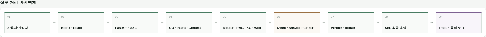
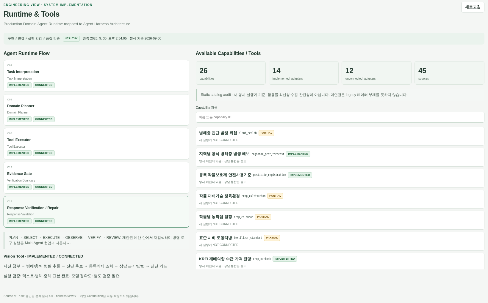
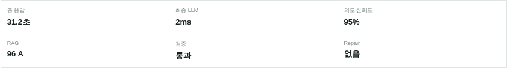
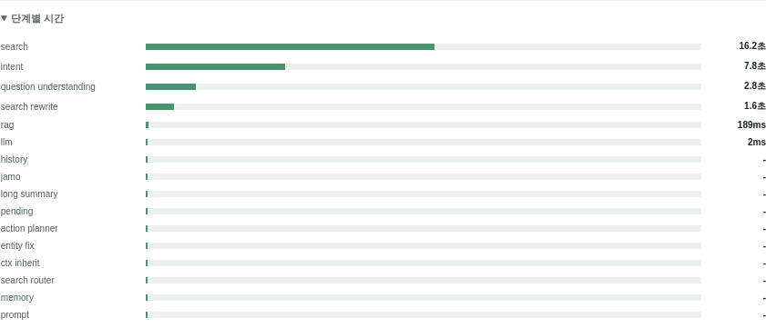
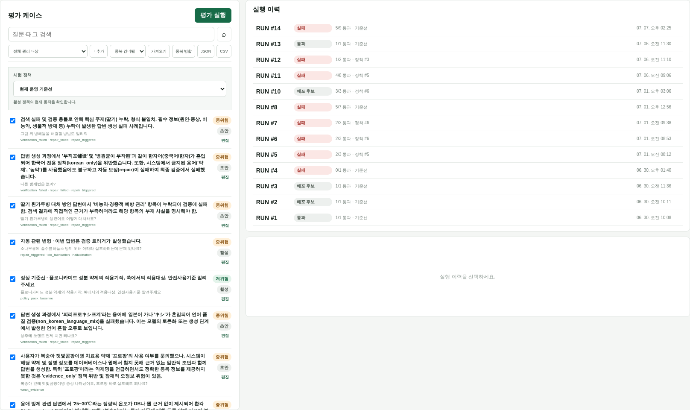
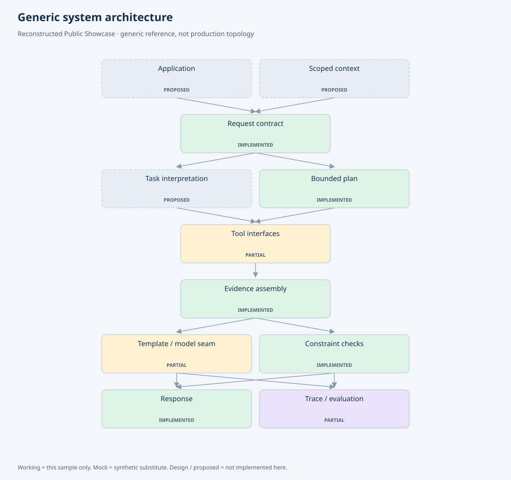

# Reliable Domain Agent Harness & Verification

### Bounded Agent Runtime · Verification · Evaluation · Traceability

[](https://github.com/YeongjoonKim/reliable-domain-agent-harness/actions/workflows/ci.yml)

## 실행 아키텍처

질문의 정보 요구를 구조화하고, 도구 실행 결과와 답변의 주장을 단계별로 검증하며,
실패 시 제한된 범위에서 복구하거나 답변을 보류하는 Agent Harness입니다.
도메인 상담 운영 시스템과 별도 Scientific Harness를 개발한 경험을 정리하고,
회사 원본 코드를 복사하지 않은 **독립 실행형 Public Core**를 제공합니다.

```text
Information Need → Explicit Plan → Registry / Tools → Observation
                                                      ↓
Result ← Accept ← Relevance / Claim / Span Verification
                         ↓ reject
                  Reflect → Bounded Retry / Abstain

Cross-cutting: Trajectory · Provenance · Sandbox · Replay · Evaluation
```

## Key Engineering Facts

| 항목 | 구성 및 구현 |
|---|---|
| Runtime | 상태 머신, 도구 권한·schema, deadline, 호출·재시도 예산으로 실행 제어 |
| Planning | 운영 상담의 LLM 질문 이해·coverage plan·검색 라우팅; 공개 코어는 명시적 Plan 실행 |
| Tool Layer | 구조화 DB·Vector·KG·웹·Vision을 Capability Catalog로 분류, 구현된 Typed Adapter로 실행 |
| Context / Memory | 최근 대화·TurnState·장기 기억을 Context Pack으로 구성 |
| Evidence | 검색 성공·질문 적합성·근거 충분성을 구분하고 claim별 출처 연결 |
| Verification | 운영 답변 검증·repair; 별도 Scientific 의미 검토; 공개 코어의 정형 claim·exact span/hash 검증 |
| Evaluation | 품질 이슈→회귀 케이스→정책 검토; 공개 합성 시나리오의 검증·복구 비교 |
| Observability | 운영 timing·검색량·검증·LLM usage; 공개 claim provenance·trace |
| Public Harness Core | Python 실행·검증 코어, Docker 격리 계산, configuration/evidence replay |
| MCP | stdio 기반 initialize / tools/list / tools/call 구현 |
| Current Boundary | 새 Typed Executor의 상담 통합은 부분 적용; 공개 코어는 정형 근거·합성 도구 범위 |

[운영 구현 대응표](docs/actual-engineering.md) · [Public Core와 소스](docs/public-core.md) ·
[상세 시스템 구성](docs/system-facts.md).

## 대표 사례: 잘못된 검색에서 복구까지

질문이 가상의 작물 재배면적을 요구하는데 같은 작물의 관수 간격 문서가 검색됩니다.
검색은 성공했지만 정보 요구가 달라 거부합니다. 대체 정형 조회에서 면적 근거를 찾은 후에만
인용 구간과 값을 검증하고 완료합니다. [공개 실행 JSON](examples/recovery.json).

`VERIFYING → REFLECTING → RETRYING → EXECUTING → VERIFYING → COMPLETED`

## 실제 구현 경험

농업 도메인 상담에서 질문·대화 맥락을 검색 계획으로 연결하고,
구조화 DB·Vector·KG·웹·Vision의 근거를 조합해 답변을 생성·검증하는 시스템을 개발했습니다.
관리자는 실행 Trace, 품질 이슈, 회귀 평가, 정책 승인으로 실패 원인과 개선 결과를 확인합니다.

질문·맥락 → 검색 계획 → 도구 실행 → 근거 결합 → 답변·검증 → SSE → Trace·회귀 평가.

별도 **Scientific Harness**에서는 goal·요구별 의미 검토, Evidence Span 선택·검증,
Docker 계산 실행, 저장된 설정·근거의 Replay를 구현했습니다.
서버가 나눈 원문 구간에서 LLM이 ID를 선택하고 서버가 해당 인용을 검증합니다.
기존 상담 전체가 이 새 실행기로 전환된 것은 아니며 [구현별 경계](docs/actual-engineering.md)를 구분합니다.

### 운영 화면

관리자 UI와 읽기 전용 데이터를 기준으로 구현 화면을 구성했습니다.
Architecture Engineering View에서 설계 책임을, 요청 추적과 회귀 평가에서 실행 이력을 확인할 수 있습니다.

### 1. Request Architecture



질문 이해부터 검색·생성·검증·SSE·Trace까지 각 단계의 실행 책임을 살펴보는 Architecture 화면입니다.

### 2. Planning & Tool Integration



Capability Catalog에 등록된 데이터와 실제 Typed Adapter가 연결된 도구를 구분합니다.

### 3. Context & Memory


대화 맥락·장기 기억을 Context Pack으로 구성해 질문 해석에 전달하는 Engineering View입니다.

### 4. Evidence & Verification



요청에 저장된 RAG 지표와 검증 결과입니다. 이 실행은 검증을 통과해 Repair가 필요하지 않았습니다.
[검증 계층 설명 화면](docs/screenshots/admin-verification.png)은 별도로 제공합니다.

### 5. Execution Trace



요청별 search·intent·question understanding·RAG 시간을 추적해 지연이 발생한 단계를 찾습니다.

### 6. Regression & Approval Gate



품질 문제를 회귀 케이스로 관리하고 기준선·정책별 실행 결과를 비교한 뒤 정책 후보를 승인합니다.

추가 상세 화면은 [Screenshot Gallery](docs/screenshots.md)에 있습니다.
수집·KREI·보고서 상세는 [Reporting](https://github.com/YeongjoonKim/ai-domain-intelligence-reporting),
이미지 모델과 상담 연결은 [Multimodal](https://github.com/YeongjoonKim/multimodal-domain-ai)에서 다룹니다.

## 독립 실행형 Public Core

`src/harness`는 상태 머신·Tool Registry·근거 검증·제한된 복구를 구현합니다.
Verifier는 **claim과 연결된 exact evidence span과 source hash를 검증**합니다.
Replay는 저장된 설정·도구 버전·근거를 대조하고 외부 도구 호출 없이 검증을 다시 실행합니다.

Agent의 Python 계산·실행은 자원과 네트워크가 제한된 **Docker Sandbox**에서 격리하며,
timeout·출력 제한·종료 상태·cleanup을 추적합니다. 명시한 로컬 image ID만 사용하고
호스트 실행으로 대체하지 않습니다. MCP는 stdio의 initialize·tools/list·tools/call을 지원합니다.

아래 도식은 초기 공개 Reference Implementation의 실행 구조를 보여줍니다.
상단의 Bounded Runtime 코어와 초기 경량 데모의 대응 관계는 [코어 문서](docs/public-core.md)에 정리했습니다.



| 구분 | 범위 |
|---|---|
| 운영 시스템 | LLM 질문 이해, 다중 검색, 맥락·메모리, evidence gate, 검증/repair, SSE, 운영 관리 |
| Public Reference Implementation | src/harness의 독립 상태 머신·registry·검증·격리·재현 구현 |
| Public Lightweight Demo | 구조화 요청 + 두 합성 도구 + session/subject 메모리 + 템플릿 답변 |

초기 경량 데모의 흐름은 Validate → Plan → Deduplicate → Execute → Assemble → Verify → Respond입니다.
실패한 도구와 성공한 도구를 구분하며 요약 모드에서는 이전 검증본을 재사용합니다.
[실행 artifact](examples/execution.json) · [Runtime source](src/sample_agent.py) ·
[공개 API 계약](docs/api-design.md).

## 실행 및 검증

Python 3.10+ 표준 라이브러리로 GPU·인증키 없이 실행합니다.

```sh
python3 -m src.harness.demo
python3 -m src.harness.evaluation
python3 -m src.sample_agent
python3 -m src.export_evidence
python3 -m unittest discover -s tests -v
python3 scripts/check_repository.py
```

공개 테스트는 실행 계약·근거 검증·복구·snapshot을 검사합니다.
[합성 비교 평가](examples/paired-evaluation.json)는 동일 입력에서 검증·재시도의 효과와 도구 호출 비용을 비교합니다.
운영 회귀 이력과 공개 테스트는 서로 다른 평가 범위로 관리합니다.
[평가 범위와 수치](docs/evaluation.md) · [Docker 실행 안내](docs/public-core.md#sandbox-and-scientific-slice) ·
[설계 결정](docs/design-decisions.md).

## 현재 범위와 한계

공개 코어는 정형 근거와 합성 도구를 사용하는 독립 구현이며, 자연어 LLM planner와 자유 서술 의미 검증은 후속 과제입니다.
Replay는 configuration/evidence 재검증, MCP는 stdio 프로토콜의 일부 범위를 제공합니다.
Docker 실행은 자원·네트워크를 제한한 계산 도구 범위이며, 독립 도메인 평가와 다중 사용자 보안 검증은 별도로 필요합니다.
운영 상담의 새 Typed Executor 통합은 부분 적용 상태입니다.

[System Facts](docs/system-facts.md) · [검증 기록](docs/validation.md) ·
[공개 경계](PUBLICATION.md) · [License notice](LICENSE-NOTICE.md) · [Security](SECURITY.md).
