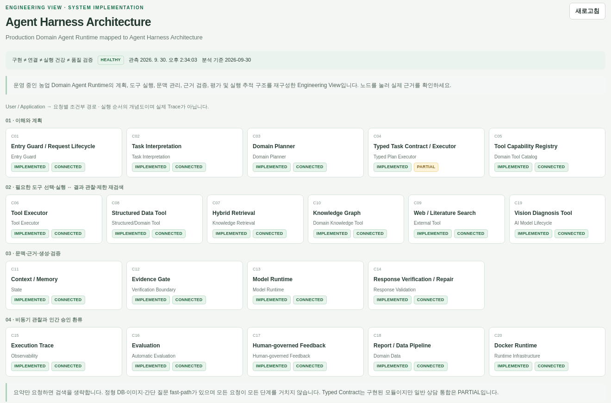
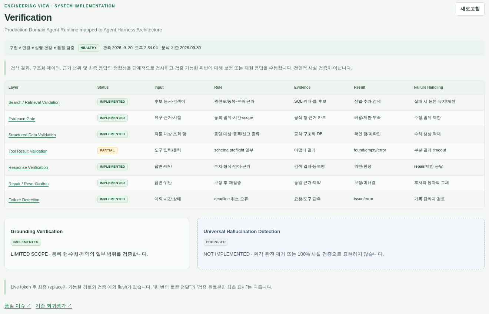
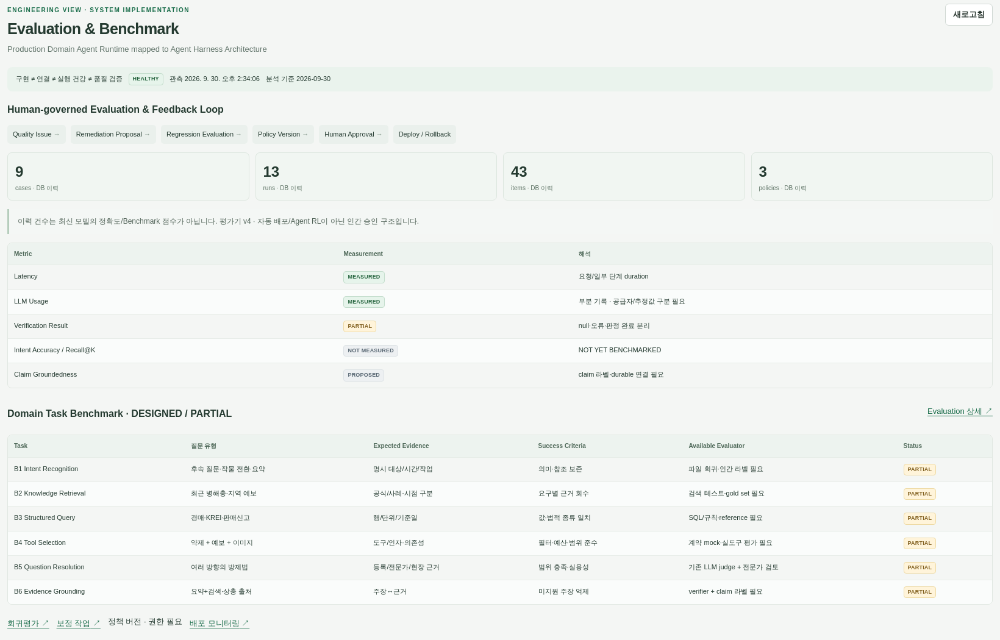
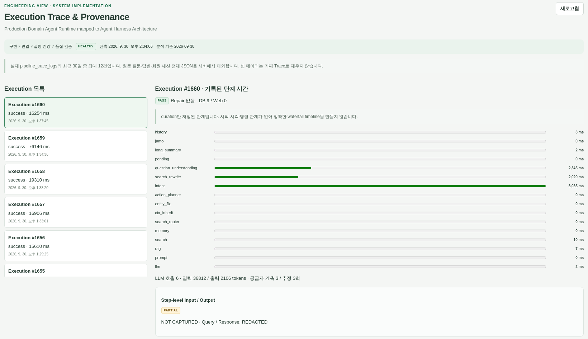

# Reliable Domain Agent Harness & Verification

### 질문의 요구를 실행 계약·근거·검증·추적으로 연결하는 Domain-bounded Agent Runtime

Planning · Tools · Evidence · Verification · Evaluation · Traceability

[](https://github.com/YeongjoonKim/reliable-domain-agent-harness/actions/workflows/ci.yml)

## Main System Architecture


실제 Domain AI 시스템의 개발 경험을 **독립적인 Public Reference Architecture와 실행 예제**로
재구성했습니다. 질문을 받았다는 사실, 도구가 데이터를 반환했다는 사실, 답변이 근거로 뒷받침된다는
판정은 서로 다릅니다. 이 저장소는 그 사이의 계약과 실패 경계를 작게 실행하고 검토하게 합니다.

공개 예제는 이미 구조화된 요청을 입력받습니다. 자연어 의도를 해석하는 LLM이나 운영 시스템 전체가
포함된 것은 아닙니다. 아래 구현 상태는 **공개 예제 기준**입니다.

This repository is a sanitized and reconstructed technical showcase based on engineering experience from a private production AI platform.
It excludes proprietary source code, credentials, personal identifiers and deployable production configuration.
Owner-approved, cropped operational screenshots are separate from the executable synthetic sample.

## 시스템 설계의 핵심 강점

| Design decision | Why | Implementation evidence | Known limitation |
|---|---|---|---|
| Bounded Agent Execution | 무한 도구 호출과 불필요한 중복을 막음 | 예산·중복 제거·deadline, 독립 async 호출 | 한 차례 실행; 재검색 loop는 제안 |
| Explicit Tool Outcomes | 빈 결과와 오류를 같은 “정보 없음”으로 처리하지 않음 | found / empty / timeout / error, 성공한 분기 보존 | 두 합성 lookup; 실 DB·웹 연결 없음 |
| Evidence-aware Generation | 출처만 붙인 잘못된 값을 거부 | 대상·값·단위의 정확한 일치 검사 | 자유 문장이나 외부 사실의 참·거짓은 보장하지 않음 |
| Scoped Context Reuse | 요약 요청에서 출처와 맥락을 보존 | session + subject 메모리, 새 검색 0회 | 프로세스 메모리; 사용자 인증·영속 저장 없음 |
| Execution Observability | 실행 순서와 근거 기여를 구분 | 논리 이벤트·fixture ID·artifact hash | 실측 latency와 전체 replay는 아님 |

[Runtime source](src/sample_agent.py) · [Behavioral tests](tests/test_sample.py) ·
[설계 결정](docs/design-decisions.md). 다양한 검색·Vision·모델 서빙 경험은 설계의 배경입니다.
현재 샘플에 모든 connector가 구현되었다고 표시하지 않습니다.

## IMPLEMENTED / PARTIAL / PROPOSED

| 영역 | 상태 | 현재 범위 |
|---|---|---|
| Agent Runtime / Domain Planner | IMPLEMENTED | 구조화 요청 검증과 유한 실행 계획; 자연어 planner 아님 |
| Tool Registry / Integration | PARTIAL | 두 합성 도구의 고정 mapping; Vector / KG / Web / Vision adapter는 미포함 |
| Verification | IMPLEMENTED | 요청·근거·정형 주장 계약 |
| Context / Memory | PARTIAL | 동일 session과 subject의 직전 답변만 재사용 |
| Claim-level Provenance | PARTIAL | fixture 참조, 운영 claim graph 없음 |
| Evaluation | IMPLEMENTED | 오프라인 회귀 테스트와 실행 probe |
| Human-governed Deployment | PROPOSED | 검토·승인 흐름의 reference design |
| Reproducible Replay | PROPOSED | hash만으로 외부 환경을 복원하지 않음 |
| LLM Interpretation / Multi-Agent / Sandbox / Agent RL | PROPOSED | 현재 실행 기능 아님 |

[System Fact Summary](docs/system-facts.md): runtime, tool, knowledge, model, API 책임을
운영 경험과 공개 구현 범위로 구분합니다.

## Agent Runtime Flow

Structured request → Validate → Plan → Select unique tools → Execute → Observe
→ Evidence assembly → Template generation → Verify → Review → Respond / Restrict

실패한 도구 때문에 성공한 다른 도구의 근거를 버리지 않습니다. Summary mode는 별도 경로로
이전 검증본만 재사용합니다. [실행 흐름 도식](docs/architecture/02_agent_runtime_flow.svg).

## Implementation Evidence

아래 다섯 장은 **실제로 구현한 운영 관리자 화면의 공개 승인된 크롭 사본**입니다.
촬영 기준은 2026-09-30이며, 테이블명·상태·수치는 보존하고 회사 표시와 개인 식별 정보는 제외했습니다.
운영 화면의 IMPLEMENTED는 비공개 플랫폼 기준이며 위 공개 코드의 구현 범위와 다릅니다.
화면 자체가 모델 정확도나 모든 경로의 실시간 성공을 증명하지는 않습니다.

별도로 누구나 실행할 수 있는 [합성 Python 결과](examples/execution.json)와
[공개 재구성 UI 6개](docs/screenshots.md#public-reconstruction)를 제공합니다.
[생성 코드](src/export_evidence.py)·[회귀 테스트](tests/test_evidence.py)가 이 별도 예제의 근거입니다.

### Agent Harness Overview



- **무엇을 보여주는가:** 운영 코드의 주요 20개 컴포넌트를 요청 이해·도구·근거·검증·환류로 매핑한 Engineering View.
- **현재 구현 범위:** 구현 여부와 상담 연결 상태를 분리한 관리자 화면.
- **Known Limitation:** 개별 요청의 실행 로그가 아니며 typed 실행기의 상담 통합은 PARTIAL로 표시됩니다.
- **Research Relevance:** 구성 요소의 존재와 실제 실행 경로의 차이를 평가하는 기준.

### Runtime & Tools


- **무엇을 보여주는가:** 계획·실행·근거 gate·검증 흐름과 capability catalog, Vision 상담 연결 설명.
- **현재 구현 범위:** 캡처 당시 45 sources·26 capabilities, 명시 실행기 기준 14 implemented / 12 unconnected adapters.
- **Known Limitation:** 정적 catalog 수치이며 호출 성공률·데이터 최신성 지표가 아닙니다. 미연결은 legacy 경로의 미사용을 뜻하지 않습니다.
- **Research Relevance:** 등록된 도구, 실행 가능한 adapter, 실제 상담 연결을 구별하는 계약.

## Verification

**What We Verify:** 허용된 요청 필드, 호출 예산, 알려진 metric, 대상·값·단위 일치,
충족되지 않은 요구를 검사합니다. 수치를 바꾼 주장을 검증기에 넣으면 거부됩니다.

**What We Cannot Guarantee:** 자연어 의도 해석, 근거 자체의 현실 정확성·최신성,
임의 생성 문장의 의미적 정합성, 보편적 hallucination 제거는 보장하지 않습니다.



- **무엇을 보여주는가:** 운영 시스템의 검색·근거·정형 데이터·응답·repair 검증 계층과 실패 처리.
- **현재 구현 범위:** 관리자 화면에서 검증 경계와 LIMITED SCOPE를 명시.
- **Known Limitation:** live token 뒤 최종 replace 또는 검증 예외 flush 경로가 남아 있습니다. 보편적 사실 검증이나 검증 완료 후에만 전달함을 보장하지 않습니다.
- **Research Relevance:** 생성 정확성뿐 아니라 검증 결과의 전달 계약까지 함께 평가.

[Verification architecture](docs/architecture/04_verification_architecture.svg).

## Evaluation

23개 테스트는 행동 계약 14개, snapshot 2개, 저장소 검사기 7개로 구성됩니다.
별도로 공개 exporter가 5개 contract probe를 실행합니다. **테스트 수나 probe 통과는 모델 정확도가 아닙니다.**



- **무엇을 보여주는가:** 운영 평가 DB 이력과 Quality Issue → Regression → Policy → Human Approval 흐름.
- **현재 구현 범위:** 캡처 당시 cases 9 / runs 13 / items 43 / policies 3; B1~B6 benchmark는 DESIGNED / PARTIAL.
- **Known Limitation:** 보존 이력 건수는 독립 평가 표본 수나 최신 모델 정확도가 아닙니다. 위 23개 공개 테스트와도 별도입니다.
- **Research Relevance:** 평가기의 누락·편향과 인간 승인 경계를 포함한 품질 환류.

Human-governed Evaluation & Feedback Loop는
품질 문제 → 개선 가설 → 회귀 평가 → 정책 후보 → 인간 검토 → 배포 판단입니다.
운영 자동 배포나 Agent RL이 아닙니다. [평가 범위](docs/evaluation.md).

## API Design

| API Domain | Responsibility | Main Input | Main Output | Status |
|---|---|---|---|---|
| Agent API | 유한 작업 실행 | session / subject / needs | 답변·근거·미해결 요구 | IMPLEMENTED, in-process |
| Retrieval API | 근거 도구 계약 | 대상 / metric | fact 또는 empty/error | PARTIAL, mock |
| Vision API | 불확실한 시각 후보 | image / metadata | 후보·신뢰 경계 | PROPOSED |
| Evaluation API | 품질 회귀 | case / expectation | 판정·실패 원인 | PARTIAL, 테스트만 |
| Admin / Engineering API | 실행 관찰 | snapshot | 공개 UI | PARTIAL, 정적 화면 |
| Reporting API | 근거 요약 보고 | 관측 / 기간 | 구조화 insight | PROPOSED, 별도 예제 |
| Health / Runtime API | 실행 모드 확인 | 없음 | offline 상태 | IMPLEMENTED, in-process |

두 demo route만 함수 dispatcher로 실행됩니다. 실제 회사 endpoint나 HTTP 서버를 공개하지 않습니다.
[입출력·오류 계약](docs/api-design.md).

## Trace / Provenance / Reproducibility



- **무엇을 보여주는가:** 실제 DB에서 개인 원문을 제외한 실행 duration·검증 상태·LLM 사용량.
- **현재 구현 범위:** 기록된 단계 시간과 공급자 계측/추정 사용량의 구분.
- **Known Limitation:** 시작 시각·병렬 관계·step I/O가 없어 정확한 waterfall이나 완전한 replay가 아닙니다. PASS는 해당 저장 검사 결과이며 답변 전체의 정답 보증이 아닙니다.
- **Research Relevance:** “무엇을 했는가”, “무엇이 근거인가”, “같은 조건을 복원할 수 있는가”를 분리.

추가 Reproducibility 화면과 Context / Memory·Scientific Extension의 현재 범위는
[화면 갤러리](docs/screenshots.md)에 정리했습니다. 미구현 화면을 구현 증거로 만들지 않습니다.

## Quick Start

Python 3.10+ 표준 라이브러리만 사용합니다. GPU·네트워크·인증키가 필요하지 않습니다.

```sh
python3 -m src.sample_agent
python3 -m src.export_evidence
python3 -m unittest discover -s tests -v
python3 scripts/check_repository.py
```

[demo/index.html](demo/index.html)을 내려받아 브라우저로 열면 UI를 확인할 수 있습니다.
GitHub 파일 링크 자체는 웹서비스 배포 주소가 아닙니다.
`src/`는 코드, `examples/`는 실행 artifact, `tests/`는 회귀,
`docs/`는 도식·설계·평가, `scripts/`와 `.github/`는 품질 검사입니다.

## Limitation / Research Extension

운영 DB 덤프·개인 원문·자연어 모델·영속 tenant 메모리·외부 connector·sandbox는 포함하지 않습니다.
승인된 관리자 캡처는 당시의 화면 증거이며, 운영 시스템을 이 저장소에서 실행할 수 있다는 뜻은 아닙니다.
[한계](docs/limitations.md)와 [검증 기록](docs/validation.md)을 코드와 함께 읽어 주세요.

후속 연구는 paraphrase·다중 턴·정정 질문의 해석, 요구별 evidence recall, freshness,
paired cost/quality, frozen snapshot에 기반한 replay입니다.
Multi-Agent는 역할 수가 아니라 품질·검증 가능성이 개선되는지 비교한 뒤 도입해야 합니다.

MY CONTRIBUTION은 사용자 확인 기반 개발 경험, PLATFORM CONTEXT는 비공개 시스템의 배경,
PUBLIC RECONSTRUCTION은 이 독립 예제, FUTURE RESEARCH는 미구현 확장입니다.
[공개 경계](PUBLICATION.md) · [License notice](LICENSE-NOTICE.md) · [Security](SECURITY.md).
공개 승인은 받았지만 오픈소스 사용권은 아직 선택하지 않았습니다.
