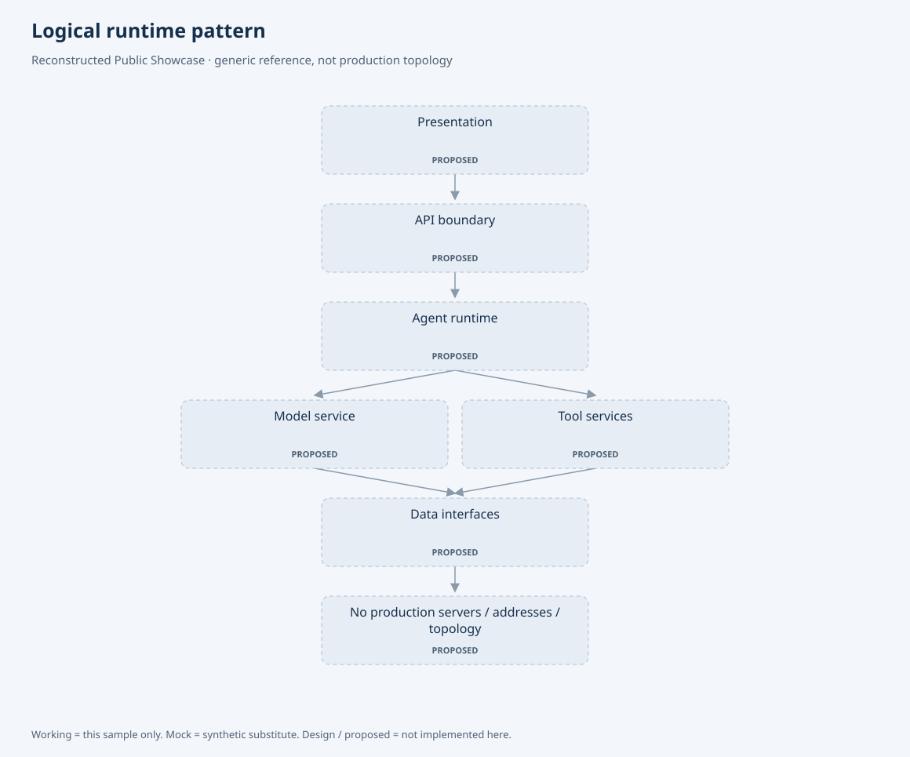

# Administrator control and host execution

관리자 화면에서 서비스 상태를 관찰하고 허용된 실행을 요청하는 제어 계층을 구현했습니다.
브라우저·API·호스트 실행기의 책임을 분리하고 요청 승인, 실제 실행, 결과 관측을 연결합니다.
2026-10-03 소스와 관리자 조회 화면을 대조했습니다.

## 서비스 제어

1. 관리자는 서비스 상태를 확인하고 재기동할 대상을 선택합니다.
2. API는 최고 관리자 권한과 허용된 서비스 식별자를 검사합니다. 요청 수락은 감사 기록에 남습니다.
3. API는 요청 ID·nonce·유효기간과 HMAC-SHA256 서명이 있는 파일을 원자적으로 기록합니다.
4. 호스트 워커가 필드·서명·유효기간·허용 목록을 검사합니다. 실행 시점 전에는 대기하고 만료된 요청은 거부합니다.
5. 허용된 식별자를 고정 Docker 명령 인자로 변환해 실행하고 결과·반환 코드·처리 기록을 저장합니다.
   이미 처리 기록이 있는 요청 ID는 건너뜁니다.
6. 관리자 상태 API가 서비스 응답과 호스트 heartbeat를 읽어 연결 상태를 표시합니다.

화면은 조회 권한으로 캡처했으므로 재기동 버튼은 비활성입니다.
실제 제어 경로는 코드로 대조했으며 캡처를 위해 서비스 재기동을 실행하지 않았습니다.
이 UI의 서비스 이름은 실행 단위 식별자입니다. 예를 들어 모델 서비스의 이름이 현재 모델 가중치의 이름을 뜻하지는 않습니다.

웹 API 컨테이너에는 Docker socket을 마운트하지 않습니다. Docker 권한은 별도 호스트 워커가 사용합니다.
API 자체 재기동은 별도 핸들러이며, 데이터베이스는 이 관리자 재기동 허용 목록에서 제외됩니다.
외부 요청의 임의 명령문을 shell로 실행하는 구조는 아닙니다.

## 세 종류의 실행 경로

| 경로 | 실행 단위 | 제어 방식 | 관측 근거 |
|---|---|---|---|
| 서비스·공공데이터 배치 | 허용 서비스 / 배치 단계 | 서명된 파일 큐와 호스트 워커 | 상태·heartbeat·단계 이력·감사 요청 |
| 모델 학습·적용 | 학습 run / adapter / Vision checkpoint | 별도 요청 파일·작업 큐와 호스트 watcher | 학습 로그·checkpoint·적용 이력 |
| Public Harness 계산 | 등록된 수치 계산 작업 | 로컬 image ID를 지정한 Docker Sandbox | 실행 결과·timeout·cleanup·artifact hash |

학습 큐와 서비스 제어 큐는 서로 다른 구현입니다. 서비스 제어의 서명 규약을 모든 watcher의 속성으로 확대하지 않습니다.
운영 컨테이너 관리와 에이전트가 실행하는 계산의 격리는 각각 다른 실행 책임을 가집니다.
[Public Core의 Docker 실행](public-core.md#sandbox-and-scientific-slice)은 계산에 네트워크·파일·사용자·자원 제한을 적용합니다.

## 관리자 메뉴와 구현 근거

| 메뉴 | 확인하는 책임 | 상세 근거 |
|---|---|---|
| 시스템 현황 | 서비스 상태, 제어 가능 대상, 호스트 heartbeat | 위 서비스 구성 화면 |
| 데이터 파이프라인 | 예약·수동 실행, 단계별 성공·실패·확인 불가, 재시도 | [Reporting 배치 운영](https://github.com/YeongjoonKim/ai-domain-intelligence-reporting/blob/main/docs/batch-operations.md) |
| LoRA 학습 현황 | run 지표, checkpoint 선택, 모델 적용 요청 | [Fine-tuning lifecycle](https://github.com/YeongjoonKim/efficient-finetuning-lab/blob/main/docs/actual-engineering.md#administrator-control) |
| 이미지 진단 모델 → 체크포인트·배포 | ONNX/OpenVINO 변환, 활성 모델, 적용 이력 | [Vision deployment](https://github.com/YeongjoonKim/multimodal-domain-ai/blob/main/docs/model-lifecycle.md) |
| Scientific Harness Lab | 실제 저장된 run, 모델 근거 판정, 인용과 재현 설정 | [Scientific 실행 근거](scientific-execution.md) |
| 요청 추적·회귀 평가·정책 버전 | 실행 시간, 품질 문제, 검증 결과와 사람의 승인 | [기존 구현 대응표](actual-engineering.md) |

서비스 제어의 허용 목록·필드 검사에 대한 기존 CPU 회귀 5건을 재실행했습니다.
공개 저장소에는 내부 실행 코드·배포 설정·서명 키 대신 책임 구조와 검토한 화면을 제공합니다.

## Capture provenance

현재 UI 빌드를 격리된 브라우저에서 읽기 전용 ASGI·DB 조회에 연결했습니다.
운영 인증을 바꾸거나 사용자 세션은 만들지 않았습니다. 표시용 검증 계정과 서비스 이름 일부를 일반화했고,
실제 상태·수치·비활성 버튼은 유지했습니다.
PNG hash는 [manifest](screenshots/manifest.json)에 기록합니다.
