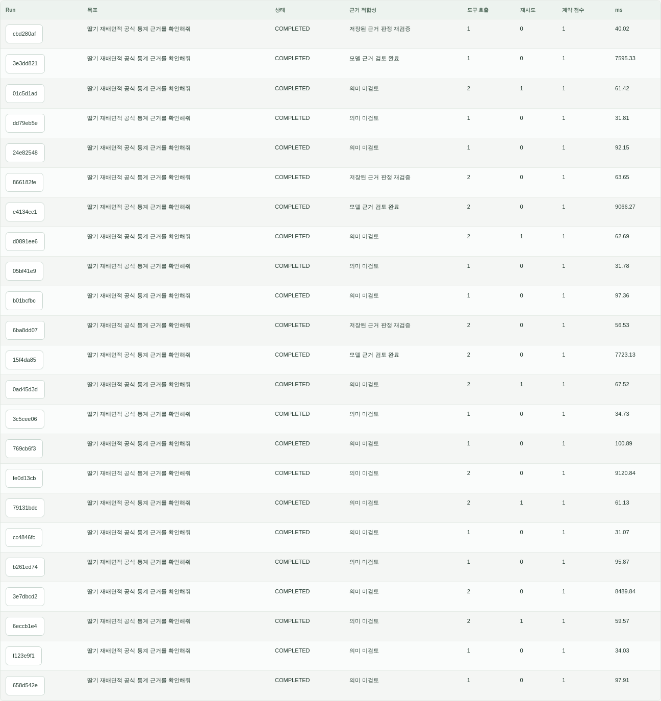
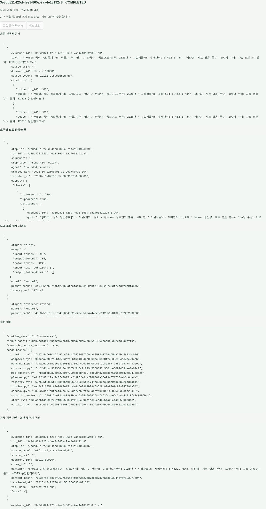

# Scientific execution evidence

별도 관리자 Runtime이 실제로 저장한 실행·판정·재현 기록입니다.
현재 UI를 통해 2026-10-03 읽기 전용으로 조회했습니다. 일반 상담, 이 관리자 실행 경로,
공개 Python Core의 입력과 평가 결과는 각각 구분됩니다.

## Run history

표에서 도구 호출·재시도·계약 점수·소요 시간과 **근거 적합성**을 함께 확인합니다.
`COMPLETED`만으로 모델 의미 검토까지 수행됐다고 판단하지 않습니다.
실행 기록은 계약 통과, 모델 근거 검토, 저장된 판정 재검증을 별도 상태로 표시합니다.

| 저장된 실행 | 확인한 동작 | 해석 범위 |
|---|---|---|
| 실제 모델 + 공식 DB | 모델 2회, 도구 1회, 6,376 tokens, 7,595.33 ms | 하나의 공식 통계 질문 실행 기록 |
| 실패 주입 + 재조회 | retry 1회 후 실제 DB 조회 완료 | 해당 실패·복구 경로의 검증 |
| Frozen replay | 외부 모델 재호출 없이 저장 근거와 판정 검증 | 저장 관측의 계약·인용 재검증 |

이 수치는 저장된 실행 시점의 측정입니다. 캡처를 위해 모델·검색·replay를 새로 실행하지 않았습니다.

## Selected evidence and provenance

1. 모델이 원문 구간의 ID를 선택합니다.
2. 서버는 해당 ID, 원문과 인용의 정확한 일치, 요구별 판정 구조를 검사합니다.
3. 채택된 발췌, 판정, 모델 usage, 코드·입출력 hash를 실행에 연결합니다.
4. Replay는 저장된 관측과 판정의 무결성을 검사하고 검증을 다시 수행합니다.

화면의 인용은 공식 통계 조회 결과이며 고객 상담이나 개인 기억이 아닙니다.
의미 적합성은 모델의 판정으로 기록되고 원문 일치는 서버가 검사합니다.
화면은 실행 추적의 증거이며 도메인 전체 정확도의 평가 결과가 아닙니다.

[공개 코어의 재현 가능한 예제](public-core.md)에서는 동일한 책임 중 정형 claim·span/hash 검증과
합성 도구 실행을 독립 코드로 확인할 수 있습니다.
