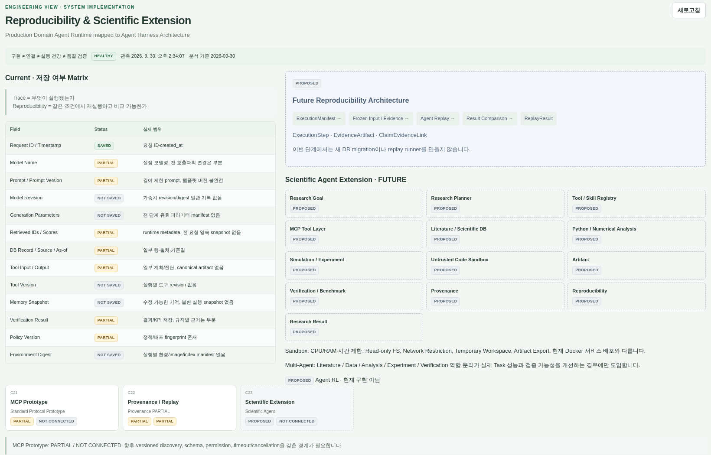
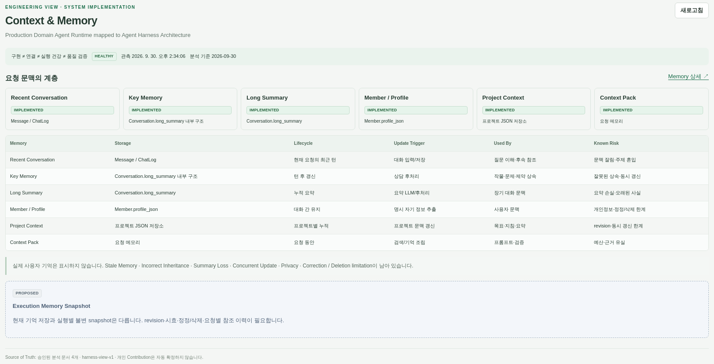
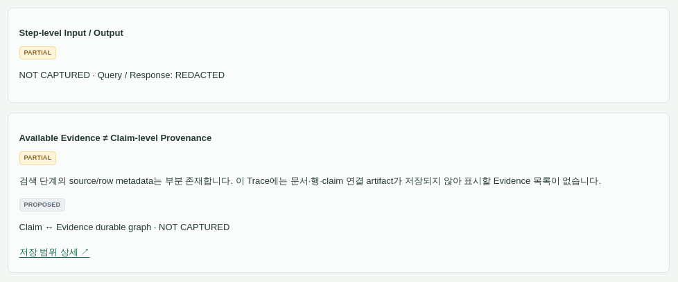

# Implementation Screenshot Gallery

아래 UI는 촬영 시점의 관리/설명 화면이며 새 공개 코어의 실행 화면이 아닙니다. 새 코어의 실제 복구·격리·재현 산출물은 [Public Core](public-core.md)에서 별도로 제공합니다.

## Actual management functions · 2026-10-02

| Harness 단계 | 실제 관리자 기능 | 화면 |
|---|---|---|
| Interpretation → Response | Architecture의 질문 처리 흐름 | [보기](screenshots/admin-request-flow.png) |
| Execution / Retrieval | 요청 추적의 실제 단계별 시간 | [보기](screenshots/admin-trace-timing.png) |
| Verification / Repair | 요청별 저장된 근거 지표·검증 결과·repair 상태 | [보기](screenshots/admin-verification-result.png) |
| Evaluation / Approval | 회귀 케이스·기준선·정책별 실행 이력 | [보기](screenshots/admin-regression.png) |

각 화면의 역할·구현 요소·Architecture 연결은 [단계별 Evidence Map](actual-engineering.md)과 README에서 설명합니다.
운영 인증을 변경하지 않는 격리된 읽기 전용 촬영이며 조회 외 작업을 실행하지 않았습니다.

## Operational evidence

2026-09-30 관리자 캡처의 공개 승인된 크롭 사본입니다. 회사 표시·개인 식별 정보를 제외하고
테이블명·상태·수치는 보존했습니다. 운영 화면의 구현 상태는 공개 Python 샘플과 별도입니다.
원본 13개 상태 중 Scientific Extension은 Reproducibility와 동일 이미지이므로 중복으로 넣지 않습니다.
이미지 클릭 시 원본 크기의 **공개 사본**을 볼 수 있습니다.

기존 Harness 설명·관찰 화면:

| 화면 | 캡처 | 증명 범위 / 한계 |
|---|---|---|
| Overview | [보기](screenshots/admin-overview.png) | 20개 컴포넌트 매핑; 요청별 trace 아님 |
| Runtime & Tools | [보기](screenshots/admin-tools.png) | catalog·adapter 상태; 호출 성공률 아님 |
| Verification | [보기](screenshots/admin-verification.png) | 검증 계층과 전달 한계; 보편적 사실 검증 아님 |
| Evaluation | [보기](screenshots/admin-evaluation.png) | DB 이력과 인간 승인; 정확도 benchmark 아님 |
| Trace | [보기](screenshots/admin-trace.png) | 비식별 duration·사용량; 완전한 waterfall 아님 |

### Reproducibility / Scientific Extension

저장·부분·미저장 항목을 나눕니다. model revision, tool version, immutable memory snapshot,
environment digest의 일관된 저장은 후속 replay 구현 과제입니다.
Scientific Extension·Sandbox·Multi-Agent·Agent RL 카드는 FUTURE / PROPOSED입니다.
연구적 가치는 완전한 재현에 필요한 누락 조건을 명시한 데 있습니다.

### Context / Memory

최근 대화·key memory·장기 요약·profile·project·context pack의 저장과 수명을 구분합니다.
실사용자 기억 내용은 표시하지 않습니다. 메모리 정확도·삭제 완전성을 증명한 화면이 아니며,
stale memory·정정·동시 갱신 문제를 후속 평가 대상으로 명시합니다.

### Provenance

검색 단계의 source metadata와 durable claim-to-evidence 연결은 다릅니다.
해당 trace에 연결 artifact가 없다는 사실을 그대로 보존했습니다.
claim graph와 step I/O의 영속 연결은 후속 구현 범위입니다.

### Engineering detail

| Detail | 캡처 | 설계 판단과 남은 범위 |
|---|---|---|
| Domain Planner | [보기](screenshots/admin-planner.png) | WHY/HOW/SOURCE·bounded review; 범용 연구 planner 미구현 |
| Tool Executor | [보기](screenshots/admin-executor.png) | 독립 호출/공유 DB session의 병렬·직렬 경계; 전 adapter 통합 미보장 |
| Verification / Repair | [보기](screenshots/admin-verification-detail.png) | repair·재검증·SSE 계약; 전면 verified-first 아님 |
| Evaluation | [보기](screenshots/admin-evaluation-detail.png) | strict 판정·인간 gate; 대표 정확도와 judge 편향 평가 필요 |

상세 화면의 소스 경로는 캡처 당시 플랫폼 구성의 설명입니다. 공개 저장소의 파일 링크가 아닙니다.
원본 운영 코드는 포함하지 않습니다.

## Public Reconstruction

이 여섯 장은 위 운영 캡처와 다른 **공개 예제 UI**입니다. 설명 카드는 정적이고
Executed Python snapshot 영역은 [exporter](../src/export_evidence.py)의
[실제 합성 실행 결과](../examples/execution.json)를 표시합니다. live LLM·운영 DB 호출이 아닙니다.

| 화면 | 캡처 | 실제 실행 증거 |
|---|---|---|
| Overview | [보기](screenshots/overview.png) | 두 합성 fact와 지원되는 답변 |
| Runtime & Tools | [보기](screenshots/tools.png) | timeout 분기·형제 결과 보존 |
| Verification | [보기](screenshots/verification.png) | 변조 수치 거부 probe |
| Evaluation | [보기](screenshots/evaluation.png) | 다섯 contract probe; 모델 benchmark 아님 |
| Trace | [보기](screenshots/trace.png) | 논리 이벤트·fixture 참조 |
| Reproducibility | [보기](screenshots/reproducibility.png) | deterministic artifact digest; 외부 환경 replay 아님 |

공개 UI는 1100px 폭으로 촬영했습니다. 모든 공개 PNG는
[manifest](screenshots/manifest.json)의 SHA-256과 비교하며 숨은 텍스트 metadata를 거부합니다.
PNG 검사는 이미지 내용의 개인정보 탐지를 대신하지 않으므로 공개 사본을 별도로 시각 검토했습니다.

## Execution management · 2026-10-03

- [서비스 상태·서명 실행기](screenshots/service-control.png)
- [저장된 Scientific run·replay](screenshots/scientific-runs.png)
- [선택 근거·판정·모델 usage·재현 설정](screenshots/scientific-evidence.png)

현재 UI를 격리된 조회 전용 브라우저에서 촬영했습니다. 모델·서비스·데이터 변경 동작은 실행하지 않았습니다.
상태·수치·실패 표시는 유지하고 공개에 불필요한 식별자를 일반화했습니다. 시간대는 Asia/Seoul입니다.
